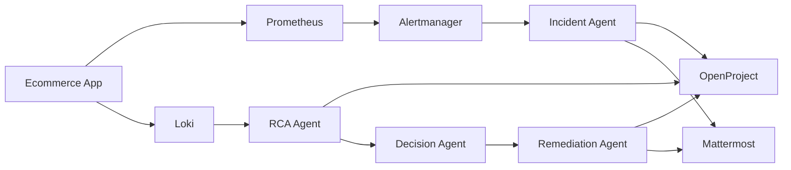

# 🧠 Agentic AIOps Incident Management Platform

An **end-to-end Agentic AIOps system** that automatically detects incidents from metrics, performs **deduplication**, **problem management**, **root cause analysis (RCA)**, **LLM-based decision making**, and **auto-remediation**, fully integrated with **OpenProject (ITSM)** and **Mattermost (ChatOps)**.

This project demonstrates how modern **SRE + ITIL + Observability + LLMs** can be combined to build a **self-healing operations platform**.

---

## 🎯 Objectives

- Detect incidents automatically from application metrics
- Reduce alert noise using deduplication
- Promote recurring incidents into **Problems**
- Perform **log-based RCA using Loki**
- Use an **LLM (Ollama)** to decide next actions
- Execute **safe auto-remediation**
- Maintain full traceability via **ITSM tickets and ChatOps**

---

## 🏗️ High-Level Architecture
```bash
Ecommerce App
│
├─ Prometheus (Metrics)
│ └─ Alertmanager
│ └─ Incident Agent
│ ├─ Incident Creation
│ ├─ Deduplication
│ └─ Problem Detection
│ └─ RCA Agent
│ ├─ Loki Log Analysis
│ ├─ Decision Agent (LLM)
│ └─ Remediation Agent
│
├─ Loki (Logs)
│ └─ Promtail
│
├─ OpenProject (ITSM)
└─ Mattermost (ChatOps)
```

## 🧩 Technologies Used

### Application & Observability
- FastAPI (Ecommerce service)
- Prometheus
- Alertmanager
- Grafana Loki
- Promtail
- Grafana

### ITSM & ChatOps
- OpenProject (Incident & Problem Management)
- Mattermost (ChatOps)

### AI / Agentic Layer
- Incident Agent
- RCA Agent
- Decision Agent (LLM-based)
- Remediation Agent

### LLM
- **Ollama** (llama3 / mistral)
- Runs fully **on-prem / private infra**

---  

## Repository Structure

```bash


├── docker-compose.yml
├── .env
├── ecommerce/
│ ├── app.py
│ └── Dockerfile
├── observability/
│ ├── prometheus/
│ ├── alertmanager/
│ ├── loki/
│ └── promtail/
├── agents/
│ ├── incident-agent/
│ ├── rca-agent/
│ ├── decision-agent/
│ └── remediation-agent/
└── README.md
```
## Architectural Diagram 

```bash
+------------------------------------------------------+
|                    Ecommerce App                     |
|                   (FastAPI Service)                  |
+----------------------+-------------------------------+
                       |
                       | Metrics & Logs
                       |
        +--------------v--------------+
        |        Observability         |
        |                              |
        |  Prometheus  <-- Metrics    |
        |       |                      |
        |       v                      |
        |  Alertmanager                |
        |       | (Webhook)            |
        |       v                      |
        |  Incident Agent              |
        |                              |
        |  Promtail --> Loki <-- Logs  |
        |               |              |
        |               v              |
        |            Grafana           |
        +--------------+--------------+
                       |
                       | Incident / Problem
                       |
        +--------------v--------------+
        |            ITSM              |
        |        OpenProject            |
        |  - Incidents                 |
        |  - Problems                  |
        |  - RCA Updates               |
        +--------------+--------------+
                       |
                       | Notifications
                       |
        +--------------v--------------+
        |           ChatOps             |
        |         Mattermost             |
        +--------------+--------------+
                       |
                       | Repeated Issues
                       |
        +--------------v--------------+
        |           RCA Agent           |
        |   - Query Logs (Loki)         |
        |   - Identify Root Cause       |
        |   - Update ITSM               |
        +--------------+--------------+
                       |
                       | Context
                       |
        +--------------v--------------+
        |        Decision Agent         |
        |      (LLM - Ollama)           |
        |  - AUTO / MANUAL / NO ACTION  |
        +--------------+--------------+
                       |
                       | AUTO_REMEDIATE
                       |
        +--------------v--------------+
        |       Remediation Agent       |
        |  - Execute Playbook (Dummy)  |
        |  - Close Incident             |
        +------------------------------+
```

## 🚀 Setup Instructions

### 1️⃣ Prerequisites

- Docker
```bash
sudo apt-get install docker.io
```

- Docker Compose
```bash
sudo curl -L "https://github.com/docker/compose/releases/download/1.29.2/docker-compose-$(uname -s)-$(uname -m)" -o /usr/local/bin/docker-compose

sudo chmod +x /usr/local/bin/docker-compose

sudo docker-compose --version
```
- Minimum 8 GB RAM recommended

---

### 2️⃣ Ollama Setup (LLM)

Run Ollama on your host or GPU server:

```bash
ollama run llama3
```

## Set-Up Stack

```bash
sudo docker compose up -d --build
```

## 🛒 Ecommerce Observability
* Endpoints
```bash
/metrics – Prometheus metrics

/orders – generates traffic

/payments – simulates failures
```

* Alerts
```bash
High traffic on Orders page

Payment failure spike

Prometheus → Alertmanager → Incident Agent
```

## 🧠 Agent Responsibilities
### 🔴 Incident Agent

* Receives alerts

* Applies deduplication

* Assigns severity & SLA

* Creates incidents in OpenProject

* Tracks repeated alerts

* Creates Problem after threshold

* Triggers RCA only after Problem creation

### 🟠 RCA Agent

* Triggered when a Problem is created

* Queries Loki logs

* Determines root cause

* Updates OpenProject Problem

* Notifies Mattermost

* Calls Decision Agent

### 🧠 Decision Agent (LLM)

* Uses Ollama LLM
```bash
Input:

Severity

Service

Root cause

Problem context

Output:

{
  "decision": "AUTO_REMEDIATE | MANUAL_ACTION | NO_ACTION",
  "confidence": 85,
  "recommended_actions": [],
  "reason": "Explanation"
}
```

### 🛠 Remediation Agent

* Triggered only for AUTO_REMEDIATE

* Executes safe remediation (dummy for PoC)

* Updates OpenProject

* Automatically closes incident on success

## 👀 How to View Results
* OpenProject
```bash 
Incidents & Problems auto-created

RCA & remediation appended

Incidents auto-closed when remediated
```

* Mattermost
```bash 
You will see:

🚨 Incident Created

🔁 Duplicate Alert

🧠 Problem Created

🧠 RCA Completed

🤖 Decision Verdict

🛠 Remediation Executed
```

* Grafana
```bash
Metrics dashboards

Loki logs

Alert states
```


## 🏁 Conclusion

**This is a production-style Agentic AIOps platform:**
```bash
✔ ITIL aligned
✔ Noise reduction
✔ RCA automation
✔ LLM-driven decisions
✔ Self-healing capable
```
